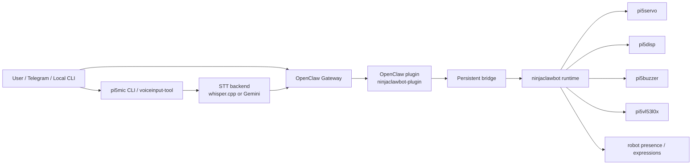

# NinjaClawBot Development Guide

<div align="center">

**Developer and maintainer reference for the NinjaClawBot workspace**

[](LICENSE)
[](https://docs.astral.sh/uv/)
[](https://www.raspberrypi.com/)
[](https://docs.openclaw.ai/)

[Project README](README.md) | [Installation Guide](InstallationGuide.md) | [Archive](backup/README.md)

</div>

---

## Contents

- [Purpose And Audience](#purpose-and-audience)
- [Project Specification](#project-specification)
- [Architecture At A Glance](#architecture-at-a-glance)
- [Repository And Package Map](#repository-and-package-map)
- [Curated Structure](#curated-structure)
- [Ownership And Runtime Boundaries](#ownership-and-runtime-boundaries)
- [Main Runtime Flows](#main-runtime-flows)
- [Public Surfaces](#public-surfaces)
- [Configuration And Runtime Files](#configuration-and-runtime-files)
- [Development Workflow](#development-workflow)
- [Validation Matrix](#validation-matrix)
- [Raspberry Pi Validation Model](#raspberry-pi-validation-model)
- [Maintenance And Extension Guidelines](#maintenance-and-extension-guidelines)
- [Bug Triage Map](#bug-triage-map)
- [Troubleshooting Shortcuts](#troubleshooting-shortcuts)

## Purpose And Audience

This document is for developers and maintainers.

Use it when you need to:

- understand the repository layout
- choose the correct package or layer for a fix
- locate the main command and API surfaces
- validate a change safely
- diagnose integration issues between the hardware libraries, `ninjaclawbot`, and OpenClaw

Use other docs when your goal is different:

- start with [README.md](README.md) for a project introduction
- start with [InstallationGuide.md](InstallationGuide.md) for a full Raspberry Pi build
- start with the package README in `pi5servo`, `pi5disp`, `pi5buzzer`, `pi5mic`, `pi5vl53l0x`, or `ninjaclawbot` if you are only touching one package

## Project Specification

The current repository targets this validated direction:

| Area | Current expectation |
| --- | --- |
| Development host | macOS or similar desktop environment |
| Deployment target | Raspberry Pi 5 |
| Python | 3.11+ |
| Workspace manager | `uv` |
| Robot runtime | `ninjaclawbot` |
| Hardware packages | `pi5servo`, `pi5disp`, `pi5buzzer`, `pi5mic`, `pi5vl53l0x` |
| Chat integration | OpenClaw plugin + workspace `BOOT.md` / `AGENTS.md` |
| Voice input | `pi5mic`, manual start, optional always-on listener |

Important design rules:

1. Each `pi5*` library should be usable and testable on its own.
2. `ninjaclawbot` composes the libraries into one robot runtime.
3. The OpenClaw plugin owns the bridge and chat-facing tool layer.
4. `pi5mic` owns microphone capture, STT selection, and the optional always-on voice-input loop.
5. Voice input is manual-start for safety and privacy. It is not an automatic background service by default.

## Architecture At A Glance



Think of the system as three layers:

1. **Standalone hardware libraries**
   Each `pi5*` package owns direct device interaction and its own setup/testing tool.

2. **Integrated robot layer**
   `ninjaclawbot` composes the packages into actions, expressions, movements, and persistent robot presence.

3. **OpenClaw integration layer**
   The plugin exposes robot tools to the OpenClaw gateway and keeps the bridge healthy during chat-driven operation.

## Repository And Package Map

| Path | Role | First place to look |
| --- | --- | --- |
| `README.md` | End-user introduction and navigation | New users |
| `InstallationGuide.md` | Full Raspberry Pi and OpenClaw deployment guide | End-to-end build work |
| `DevelopmentGuide.md` | Developer and maintainer reference | Architecture, validation, triage |
| `backup/DevelopmentLog.md` | Chronological change archive | What changed and why |
| `ninjaclawbot/` | Integrated robot runtime | Robot actions, expressions, assets |
| `pi5servo/` | Servo driver package | Servo issues, calibration, motion |
| `pi5disp/` | Display driver package | Display setup and rendering |
| `pi5buzzer/` | Buzzer driver package | Sound and buzzer behavior |
| `pi5mic/` | Microphone and voice input package | STT, voice flow, OpenClaw voice handoff |
| `pi5vl53l0x/` | Distance sensor package | I2C and range sensing |
| `integrations/openclaw/ninjaclawbot-plugin/` | OpenClaw plugin | Tool exposure, diagnostics, lifecycle hooks |
| `ninjaclawbot_data/` | Saved expressions and movements | Content assets |

## Curated Structure

This is the developer-facing repository shape you will use most often.

```text
NinjaClawBot/
├── README.md
├── InstallationGuide.md
├── DevelopmentGuide.md
├── LICENSE
├── pyproject.toml
├── uv.lock
├── backup/
│   ├── README.md
│   └── DevelopmentLog.md
├── ninjaclawbot/
│   ├── README.md
│   ├── pyproject.toml
│   ├── src/ninjaclawbot/
│   │   ├── __main__.py
│   │   ├── actions.py
│   │   ├── adapters.py
│   │   ├── assets.py
│   │   ├── config.py
│   │   ├── executor.py
│   │   ├── presence.py
│   │   ├── runtime.py
│   │   ├── cli/
│   │   ├── expressions/
│   │   └── openclaw/
│   └── tests/
├── pi5servo/
│   ├── README.md
│   ├── src/pi5servo/
│   └── tests/
├── pi5disp/
│   ├── README.md
│   ├── src/pi5disp/
│   └── tests/
├── pi5buzzer/
│   ├── README.md
│   ├── src/pi5buzzer/
│   └── tests/
├── pi5mic/
│   ├── README.md
│   ├── src/pi5mic/
│   │   ├── __main__.py
│   │   ├── cli/
│   │   ├── config/
│   │   ├── core/
│   │   ├── install/
│   │   ├── integration/
│   │   ├── stt/
│   │   ├── transport/
│   │   ├── vad/
│   │   └── wakeword/
│   └── tests/
├── pi5vl53l0x/
│   ├── README.md
│   ├── src/pi5vl53l0x/
│   └── tests/
├── ninjaclawbot_data/
│   ├── expressions/
│   └── movements/
└── integrations/openclaw/ninjaclawbot-plugin/
    ├── openclaw.plugin.json
    ├── src/
    └── tests/
```

## Ownership And Runtime Boundaries

| Layer | Owns | Does not own |
| --- | --- | --- |
| `pi5servo` | Servo endpoints, calibration, movement hardware behavior | High-level robot conversation logic |
| `pi5disp` | Display driver, display config, display rendering | Reply policy or Telegram flow |
| `pi5buzzer` | Tone generation and buzzer playback | OpenClaw bridge behavior |
| `pi5vl53l0x` | Distance sensor access and sensor diagnostics | Robot expression policy |
| `pi5mic` | Recording, STT, OpenClaw voice handoff, always-on listener | Main text-chat bridge ownership |
| `ninjaclawbot` | Integrated actions, expressions, asset playback, persistent idle/listening/thinking states | Direct microphone streaming loop |
| OpenClaw plugin | Lifecycle hooks, bridge startup, tool registration, diagnostics | Hardware drivers themselves |

Important practical rules:

- If only one hardware module is wrong, start in the matching `pi5*` package.
- If an action or expression is wrong, start in `ninjaclawbot`.
- If the robot behaves correctly locally but not through chat, start in the OpenClaw plugin and deployment files.
- If the microphone records correctly but voice-to-OpenClaw flow is wrong, start in `pi5mic`, not in the plugin.

## Main Runtime Flows

### Local hardware tool flow

1. A package CLI such as `pi5servo servo-tool` or `pi5disp display-tool` loads its package config.
2. The tool calls package-local driver and core modules.
3. The tool saves or exports package config and assets.
4. `ninjaclawbot` later reuses that config or those assets.

### Local integrated robot flow

1. `uv run ninjaclawbot ...` enters `ninjaclawbot/src/ninjaclawbot/__main__.py`.
2. CLI helpers build an executor from the root project directory.
3. `ActionRequest` validates the action name and parameters.
4. `executor.py` dispatches to the runtime.
5. `runtime.py` calls the standalone packages through adapters.

### OpenClaw text flow

1. A user sends a message through Telegram or another OpenClaw channel.
2. OpenClaw selects the NinjaClawBot tool path.
3. The plugin forwards the tool call through the persistent bridge.
4. `ninjaclawbot` animates the robot and returns structured output.
5. OpenClaw still sends the normal visible text reply after the robot action.

### `pi5mic` voice flow

1. `voiceinput-tool` or `run --once` captures audio locally.
2. `pi5mic` sends the audio to `whisper.cpp` or Gemini.
3. `pi5mic` sends the original-language transcript to OpenClaw.
4. OpenClaw replies through the normal agent path.
5. The listener stays single-flight and uses this state sequence:

`LISTENING -> TRANSCRIBING -> DISPATCHING -> WAITING_FOR_REPLY -> COOLDOWN`

During this sequence, new wake words are intentionally ignored so multiple voice requests cannot overlap.

## Public Surfaces

### `ninjaclawbot` CLI

Command source: `ninjaclawbot/src/ninjaclawbot/__main__.py`

| Command | Purpose |
| --- | --- |
| `health-check` | Run an integrated hardware availability check |
| `list-assets` | List saved movement and expression assets |
| `list-capabilities` | Show supported actions, reply states, and asset types |
| `run-action` | Execute a JSON action payload |
| `move-servos` | Move servos using `movement-tool` style endpoint syntax |
| `perform-movement` | Run a saved movement asset |
| `perform-reply` | Run the built-in reply-emotion pipeline |
| `perform-expression` | Run a saved or built-in expression |
| `set-idle` | Start the persistent idle expression |
| `stop-expression` | Stop the active expression loop |
| `expression-tool` | Interactive expression creation and preview |
| `movement-tool` | Interactive movement creation and preview |
| `voiceinput-tool` | Optional wrapper around `pi5mic voiceinput-tool` |

### `pi5mic` CLI

Command source: `pi5mic/src/pi5mic/__main__.py`

| Command | Purpose |
| --- | --- |
| `devices` | List available microphone input devices |
| `record` | Record a bounded WAV file |
| `transcribe` | Transcribe an existing audio file |
| `run` | Run one configured standalone or OpenClaw microphone cycle |
| `setup` | Guided configuration wizard |
| `doctor` | Check config, microphone readiness, STT, voice-input readiness, and OpenClaw handoff |
| `status` | Show current config and readiness summary |
| `mic-tool` | Guided menu for common setup and testing tasks |
| `voiceinput-tool` | Manual always-on listener controls |
| `install whispercpp` | Register the local `whisper.cpp` backend |
| `install openwakeword` | Register the wake-word model path and runtime assets |
| `config show/export/import` | Manage `mic.json` files |

### Other `pi5*` interactive tools

| Package | Tool | Purpose |
| --- | --- | --- |
| `pi5servo` | `servo-tool` | Servo setup, calibration, safe motion tests |
| `pi5disp` | `display-tool` | Display setup, preview, and config export |
| `pi5buzzer` | `buzzer-tool` | Tone and sound testing |
| `pi5vl53l0x` | `sensor-tool` | Distance sensor verification |

### Stable robot action surface

Action source: `ninjaclawbot/src/ninjaclawbot/actions.py`

Stable action names:

- `health_check`
- `list_capabilities`
- `move_servos`
- `perform_movement`
- `perform_reply`
- `display_text`
- `play_sound`
- `show_expression`
- `perform_expression`
- `set_idle`
- `set_presence_mode`
- `stop_expression`
- `shutdown_sequence`
- `read_distance`
- `list_assets`
- `stop_all`

Important required parameters:

| Action | Required parameters |
| --- | --- |
| `move_servos` | `targets` |
| `perform_movement` | `name` |
| `perform_reply` | `text`, `reply_state` |
| `display_text` | `text` |
| `perform_expression` | `name` |
| `set_presence_mode` | `mode` |

### OpenClaw plugin tool surface

Tool source: `integrations/openclaw/ninjaclawbot-plugin/src/index.ts`

| Tool | Purpose |
| --- | --- |
| `ninjaclawbot_reply` | Animate a conversational reply, then let OpenClaw send the visible text reply |
| `ninjaclawbot_perform_expression` | Run a saved or built-in expression |
| `ninjaclawbot_perform_movement` | Run a saved movement asset |
| `ninjaclawbot_move_servos` | Move servos directly |
| `ninjaclawbot_read_distance` | Read the current distance value |
| `ninjaclawbot_health` | Run a hardware health check |
| `ninjaclawbot_voiceinput_status` | Report whether optional `pi5mic` voice input is installed and ready |
| `ninjaclawbot_capabilities` | List supported actions and assets |
| `ninjaclawbot_set_idle` | Start the idle face |
| `ninjaclawbot_diagnostics` | Inspect bridge health and deployment readiness |
| `ninjaclawbot_stop` | Stop the active expression loop |
| `ninjaclawbot_stop_all` | Stop all active robot outputs |

Also exposed:

- gateway method `ninjaclawbot.presence.set` for presence updates used by `pi5mic` and the plugin lifecycle path

## Configuration And Runtime Files

| File | Owner | Purpose |
| --- | --- | --- |
| `pyproject.toml` | root workspace | Installs the whole workspace |
| `uv.lock` | root workspace | Locked dependency graph |
| `servo.json` | root project | Servo runtime config |
| `display.json` | root project | Display config used by `ninjaclawbot` |
| `buzzer.json` | root project | Buzzer runtime config |
| `vl53l0x.json` | root project | Distance sensor config |
| `mic.json` | root project or standalone `pi5mic` directory | Microphone, STT, OpenClaw, and voice-input config |
| `ninjaclawbot_data/movements/*.json` | root project | Saved motion assets |
| `ninjaclawbot_data/expressions/*.json` | root project | Saved expression assets |
| `BOOT.md` | root workspace | Startup greeting and session boot guidance |
| `AGENTS.md` | root workspace | Tool and behavior instructions for OpenClaw/Codex-style agents |
| `~/.openclaw/openclaw.json` | OpenClaw install | Gateway, plugins, skills, allowlist, and deployment config |
| `.pi5mic-voiceinput-state.json` | `pi5mic` runtime | Listener state file |
| `.pi5mic-voiceinput.log` | `pi5mic` runtime | Listener log file |

Important note for display maintenance:

- `pi5disp` stores its own package config
- `ninjaclawbot` prefers the root-level `display.json`
- after display setup, export the package config to the root:

```bash
cd ~/NinjaClawBot
uv run pi5disp config export "$PWD/display.json"
```

## Development Workflow

Use this order for normal development work:

1. reproduce the issue or confirm the desired behavior
2. choose the correct layer
3. make the smallest safe change
4. run the matching validation gate
5. update the docs
6. write Raspberry Pi validation steps if hardware behavior changed

### Which layer to change

| Symptom | Start here |
| --- | --- |
| Servo endpoint or calibration issue | `pi5servo` |
| Display orientation, contrast, or config issue | `pi5disp` |
| Buzzer playback issue | `pi5buzzer` |
| VL53L0X or I2C issue | `pi5vl53l0x` |
| Microphone recording, STT, wake-word, or voice dispatch issue | `pi5mic` |
| Expression policy or action orchestration issue | `ninjaclawbot` |
| Chat-driven behavior differs from local behavior | OpenClaw plugin and deployment files |

## Validation Matrix

### Workspace Python gate

Use this from the repository root:

```bash
uv run --extra dev python -m compileall .
uv run --extra dev ruff check .
uv run --extra dev ruff format --check .
uv run pytest -q pi5buzzer/tests -c pi5buzzer/pyproject.toml
uv run pytest -q pi5servo/tests -c pi5servo/pyproject.toml
uv run pytest -q pi5disp/tests -c pi5disp/pyproject.toml
uv run pytest -q pi5vl53l0x/tests -c pi5vl53l0x/pyproject.toml
uv run pytest -q pi5mic/tests -c pi5mic/pyproject.toml
uv run pytest -q ninjaclawbot/tests -c ninjaclawbot/pyproject.toml
```

Why it is written this way:

- the workspace contains multiple sibling packages
- package-specific pytest commands are the stable validated path
- a generic root `pytest -q` is not the preferred gate for this repo

### Package-level Python gate

Example for one package:

```bash
cd /path/to/NinjaClawBot/pi5mic
uv run --extra dev python -m compileall src tests
uv run --extra dev ruff check src tests
uv run --extra dev ruff format --check src tests
uv run --extra dev pytest -q tests -c pyproject.toml
```

### OpenClaw plugin gate

```bash
cd /path/to/NinjaClawBot/integrations/openclaw/ninjaclawbot-plugin
npm install
npm run typecheck
npm test
```

## Raspberry Pi Validation Model

Use these four buckets whenever hardware-facing behavior changes.

### Safe smoke tests

- `uv run ninjaclawbot health-check`
- `uv run ninjaclawbot expression-tool`
- `uv run pi5disp display-tool`
- `uv run pi5vl53l0x sensor-tool`
- `uv run pi5mic doctor`

### Device communication tests

- `i2cdetect -y 1`
- microphone device listing
- OpenClaw startup
- `ninjaclawbot_diagnostics`
- Telegram message and reply cycle

### Actuator-moving tests

- `uv run pi5servo servo-tool`
- `uv run ninjaclawbot movement-tool`
- one small known-safe movement only

### Power-risk tests

- `openclaw gateway restart`
- `openclaw gateway stop`
- confirm sleepy face then display power-down
- for voice input, run a repeated wake-word cycle test and watch Pi temperature and throttling

## Maintenance And Extension Guidelines

### Adding a new hardware behavior

1. Put direct device logic in the matching `pi5*` package.
2. Add or update its interactive tool if the new behavior needs setup or manual testing.
3. Only then expose it through `ninjaclawbot` if it belongs in the integrated robot layer.

### Adding a new robot action

1. Add the action to `ActionType` in `ninjaclawbot/src/ninjaclawbot/actions.py`.
2. Define validation rules and required parameters.
3. Teach the executor/runtime how to run it.
4. Add tests.
5. If OpenClaw should call it directly, decide whether a new plugin tool is needed.

### Adding a new OpenClaw tool

1. Confirm the behavior already exists in `ninjaclawbot`.
2. Register the tool in `integrations/openclaw/ninjaclawbot-plugin/src/index.ts`.
3. Add schema support if needed.
4. Update plugin tests and deployment docs.

### Adding a new voice feature

1. Start in `pi5mic`.
2. Keep microphone runtime ownership there.
3. Only add a thin wrapper or status surface in `ninjaclawbot` or the plugin when needed.
4. Avoid turning voice input into an automatic background service without an explicit safety decision.

## Bug Triage Map

| Problem | First check | Likely owner |
| --- | --- | --- |
| Local hardware tool fails | matching package README and package tests | matching `pi5*` package |
| `ninjaclawbot health-check` fails | root config files and adapters | `ninjaclawbot` |
| Robot reacts locally but not through OpenClaw | plugin diagnostics, allowlist, skill, bridge | OpenClaw plugin |
| Telegram text missing but robot motion/expression works | OpenClaw tool usage and reply path | OpenClaw deployment |
| Voice capture works but chat handoff fails | `pi5mic doctor`, `status`, OpenClaw profile | `pi5mic` |
| Wake word works once but not repeatedly | `voiceinput-tool` state, overflow handling, presence timing | `pi5mic` |
| Startup greeting missing | `BOOT.md`, `boot-md`, diagnostics | OpenClaw deployment + plugin |

## Troubleshooting Shortcuts

### `pi5mic` says `PortAudio library not found`

Install the Raspberry Pi system packages first:

```bash
sudo apt update
sudo apt install -y libportaudio2 portaudio19-dev
```

Then rerun:

```bash
uv run pi5mic doctor
```

### `pi5mic` says `Invalid sample rate`

The microphone exists, but ALSA does not accept the saved rate in `mic.json`.

Fix path:

```bash
uv run pi5mic setup
uv run pi5mic doctor
```

Accept the sample rate recommended by the wizard. Many Raspberry Pi microphones prefer `44100` Hz or `48000` Hz.

### `pi5mic` says `openwakeword` is missing or the model is not ready

Install the optional dependency and register the model:

```bash
uv sync --extra dev --extra voiceinput
uv run pi5mic install openwakeword --model-path ~/NinjaClawBot/voiceinput/hey_ninja.onnx
uv run pi5mic doctor
```

### `pi5mic` says `pairing required` in OpenClaw mode

Use the guided recovery path first:

```bash
uv run pi5mic setup
```

Choose `Profile: openclaw` and let `pi5mic` auto-discover the OpenClaw settings. Approve the newest local device request when asked.

### `pi5mic` says `Invalid session ID` in OpenClaw mode

Older configs used a legacy `voice:local-mic` session id. Current `pi5mic` migrates that automatically to the safe value `voice-local-mic`.

Safest recovery:

```bash
uv run pi5mic setup
uv run pi5mic doctor
uv run pi5mic run --once
```

### Voice listener works once but does not re-arm well

Check:

- `uv run pi5mic doctor`
- `uv run pi5mic voiceinput-tool foreground`
- `.pi5mic-voiceinput.log`

Important current behavior:

- wake words are ignored while the previous request is still busy on purpose
- repeated audio overflow should trigger stream recovery, not permanent failure
- OpenClaw presence issues should degrade to warnings, not block the whole voice loop

### Display works in `display-tool` but looks wrong in `expression-tool`

Export the display package config to the root project file:

```bash
cd ~/NinjaClawBot
uv run pi5disp config export "$PWD/display.json"
uv run ninjaclawbot health-check
```

### Robot reacts but Telegram shows no text

Check:

- workspace `AGENTS.md`
- the `ninjaclawbot_control` skill
- OpenClaw allowlist entries for `ninjaclawbot_reply`

If this only happens on `pi5mic` voice turns, rerun:

```bash
uv run pi5mic status
```

Confirm that a reply target is saved.

### Startup greeting is missing

Check:

- `boot-md` is enabled
- workspace `BOOT.md` exists and contains the intended greeting
- `ninjaclawbot_diagnostics` shows startup tracking as expected

### Best first debugging command

When the bridge is up, start with the OpenClaw diagnostics tool. It usually gives the fastest single view of deployment readiness, bridge health, and recovery hints.
